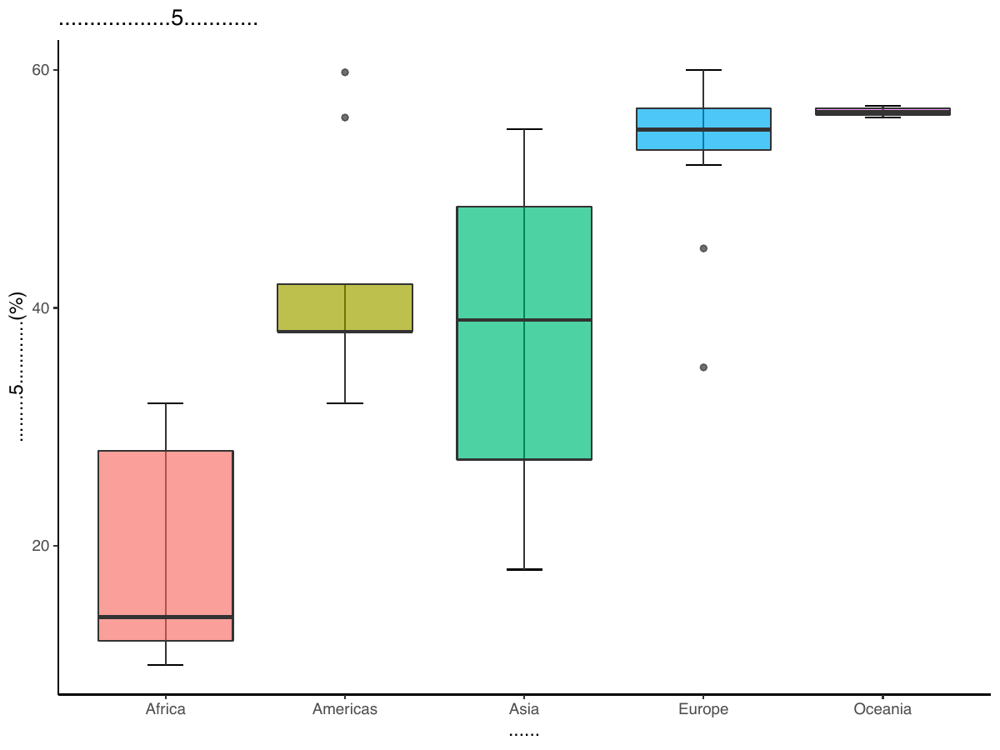
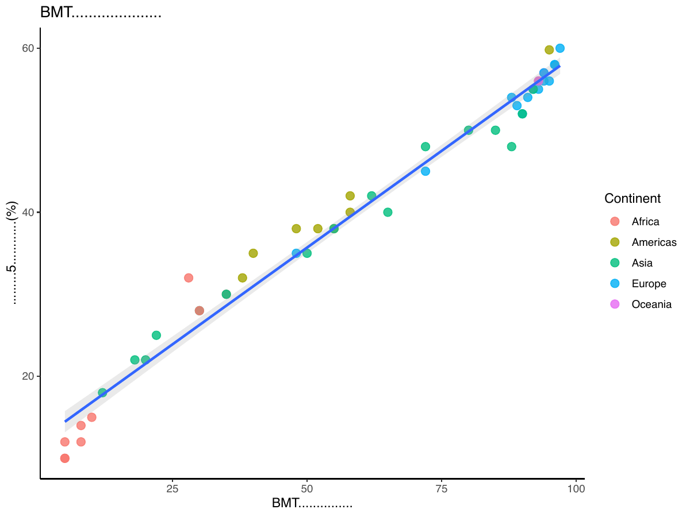
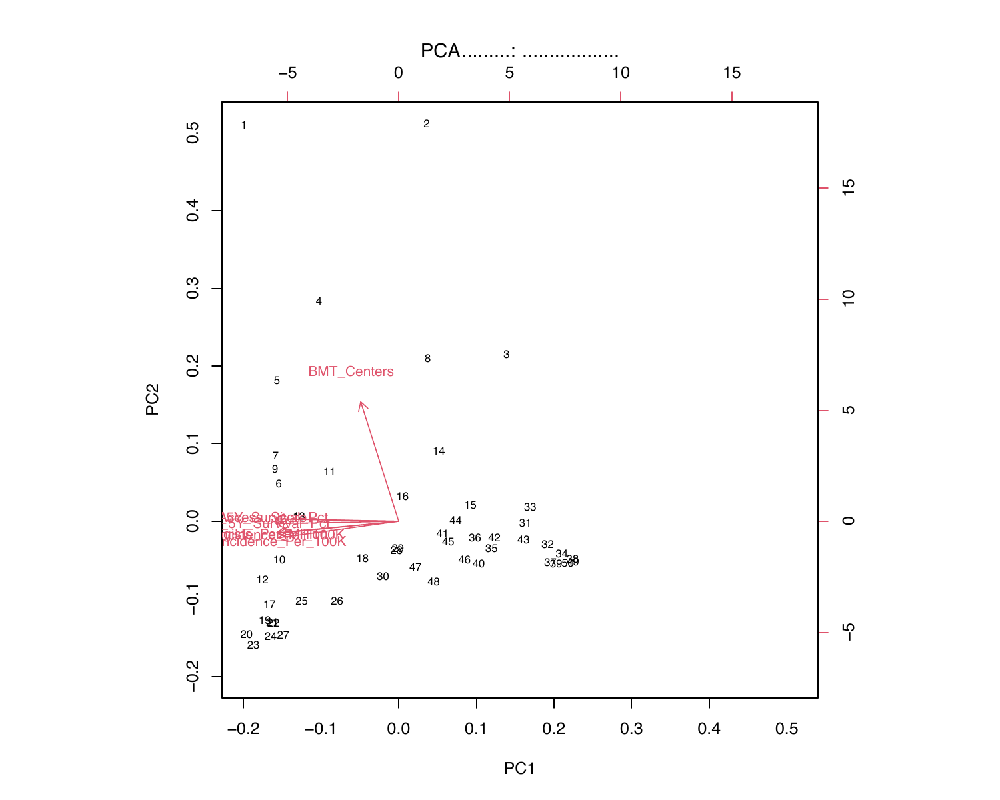
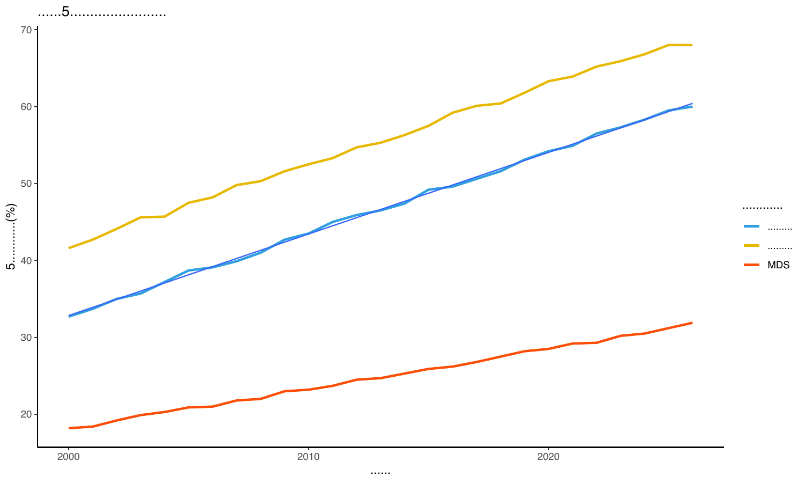

# R Medical Statistics Skills

<p align="center">
  
</p>

[中文版](README.md)

An AI coding agent skills collection for medical statistics and R-based statistical analysis. The project uses a generic `SKILL.md` structure that can be used by Codex and by other coding agents that support skills, rules, or knowledge-base directories. You can also send the relevant directories to an agent and let it install or read them for its own runtime. The project includes basic statistics, advanced statistics, commonly used methods in medical literature, and helper skills for creating plain R scripts, statistical reports, and Jupyter notebooks.

## Contents

- `basic-stats/`: Basic medical statistics skills, including t-tests, ANOVA, chi-square tests, correlation analysis, ROC analysis, sample size estimation, and statistical plotting.
- `advanced-stats/`: Advanced statistics skills, including ANCOVA, multiple regression, logistic regression, survival analysis, PCA, structural equation modeling, and multilevel models.
- `literature-stats/`: Skills for methods commonly seen in medical literature, including propensity score methods, Fine-Gray models, restricted cubic splines, subgroup analysis, and trend tests.
- `r-script/`: Original R script skill for generating reproducible `.R` analysis scripts for RStudio, command-line R, and non-notebook users.
- `quarto-report/`: Original Quarto/R Markdown report skill for generating medical statistics reports exportable to HTML, Word, or PDF.
- `jupyter-notebook/`: Original Jupyter Notebook skill for creating, organizing, and validating reproducible notebooks.
- `example/`: Reproducible examples based on public Kaggle datasets, including demo data, notebooks, R scripts, statistical tables, and generated figures.

## Examples

The `example/` directory provides one complete representative medical statistics case study showing how these skills turn public data into a reproducible R analysis workflow. The example includes raw data in `data/`, analysis scripts and result tables in `analysis/`, and report-ready figures in `analysis/figures/`.

### Global Bone Marrow Cancer Dataset

- **Dataset**: [Global Bone Marrow Cancer Dataset](https://www.kaggle.com/datasets/zkskhurram/global-bone-marrow-cancer-dataset)
- **Example directory**: `example/global-bone-marrow-cancer-dataset/`
- **Size**: Country-level and trend datasets covering myeloma/leukemia incidence, survival, bone marrow transplant access, hematologist availability, treatment patterns, and 2000-2026 trends.

This example demonstrates a public-health and health-services research workflow: whether cancer burden, treatment access, and survival outcomes differ systematically across regions. Unlike the two notebook-based examples above, this example is organized as a set of R scripts, making it a useful showcase for the `r-script/` skill and reproducible `.R` analysis pipelines.

Main outputs in `analysis/`:

- `table1_by_continent.csv`: Descriptive statistics by continent. Europe and Oceania show higher myeloma 5-year survival, BMT access scores, and hematologists per million than regions such as Africa.
- `01_descriptive_stats_plots.R` to `06_trend_analysis.R`: Topic-based R scripts covering descriptive statistics, correlation tests, ANOVA/chi-square tests, regression, PCA/clustering, and trend analysis.
- `04_regression.R`: Multivariable linear regression for myeloma 5-year survival and logistic regression for high-survival countries.
- `05_pca_cluster_survival.R`: PCA and clustering of country-level indicators to explore combined patterns in incidence, survival, and health-care resources.

Representative figures are shown directly below as PNG images. The corresponding PDF versions are kept in the same directory for report layouts or manuscript appendices.

**Myeloma 5-year survival by continent**



**BMT access and myeloma 5-year survival**



**PCA biplot for country-level indicators**



**Global survival trends from 2000 to 2026**



Example plotting code:

```r
library(ggplot2)

ggplot(country, aes(x = BMT_Access_Score, y = Myeloma_5Y_Survival_Pct, color = Continent)) +
  geom_point(size = 3, alpha = 0.85) +
  geom_smooth(method = "lm", se = TRUE, color = "grey30") +
  theme_bw() +
  labs(
    title = "BMT access and 5-year myeloma survival",
    x = "BMT access score",
    y = "Myeloma 5-year survival (%)",
    color = "Continent"
  )
```

## Recommended workflows

- **Plain R scripts**: Use `r-script/` for users who do not use Jupyter. It produces `analysis.R` files that can be sourced in RStudio or run with `Rscript analysis.R`.
- **Jupyter Notebook**: Use for interactive exploration, teaching walkthroughs, step-by-step explanation, and `.ipynb` deliverables.
- **Quarto / R Markdown reports**: Use `quarto-report/` for formal reports, manuscript appendices, project summaries, and exportable HTML, Word, or PDF outputs.

## Install

Default Codex install:

```bash
curl -fsSL https://raw.githubusercontent.com/LeiGao0203/R-Medical-Statistics-Skills/main/install.sh | bash
```

For other coding agents, point the installer at that agent's skills, rules, or knowledge-base directory:

```bash
curl -fsSL https://raw.githubusercontent.com/LeiGao0203/R-Medical-Statistics-Skills/main/install.sh | AGENT_SKILLS_DIR=/path/to/agent/skills bash
```

You can also send this repository URL or the command above to an agent and let it complete the installation with its own tools. Restart or refresh the agent after installation. The skills will then be available for relevant medical statistics, R scripting, statistical report, and notebook tasks.

## License

This repository uses multiple licenses:

- Content in `basic-stats/`, `advanced-stats/`, and `literature-stats/` that is related to or adapted from *R语言实战医学统计* is adapted from [R_medical_stat](https://github.com/ayueme/R_medical_stat) by 阿越就是我 and is released under CC BY-SA 4.0.
- `r-script/`, `quarto-report/`, and `jupyter-notebook/` are original content and are released under Apache License 2.0.
- Data under `example/` comes from the corresponding Kaggle datasets; reuse should follow the license terms listed on the Kaggle dataset pages.

See [LICENSE](LICENSE) for details.

## Attribution

Part of the medical statistics skill content is organized and adapted from *R语言实战医学统计*. When redistributing, modifying, or adapting related content, please preserve the original attribution and CC BY-SA 4.0 license notice.

## Contributing

Contributions are welcome, including new statistical methods, corrections to R examples, improvements to method-selection logic, and reproducible examples. Please read [CONTRIBUTING.md](CONTRIBUTING.md) before contributing.
