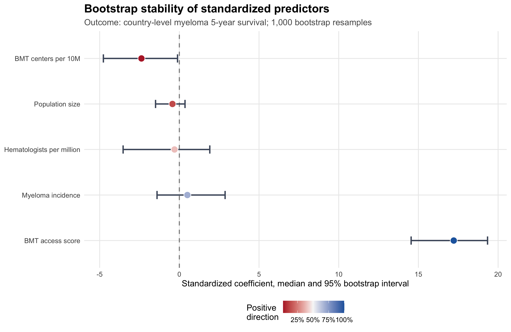
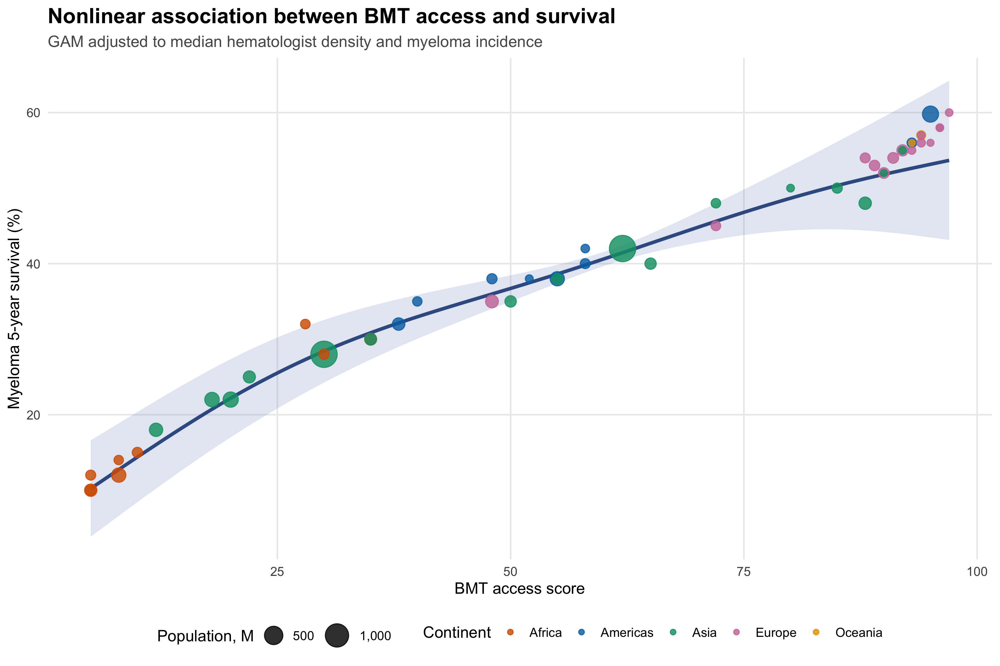
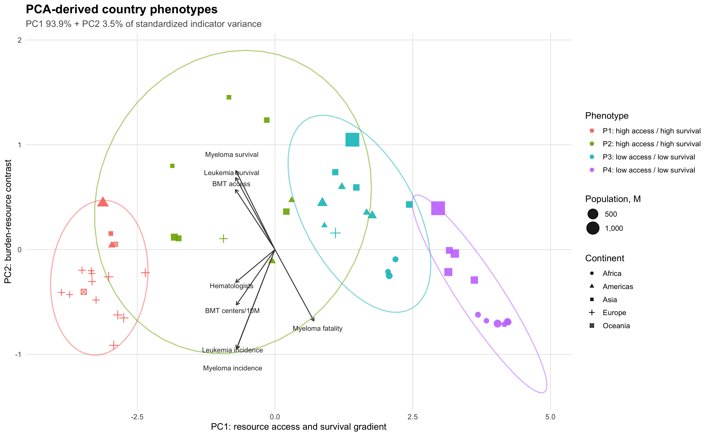
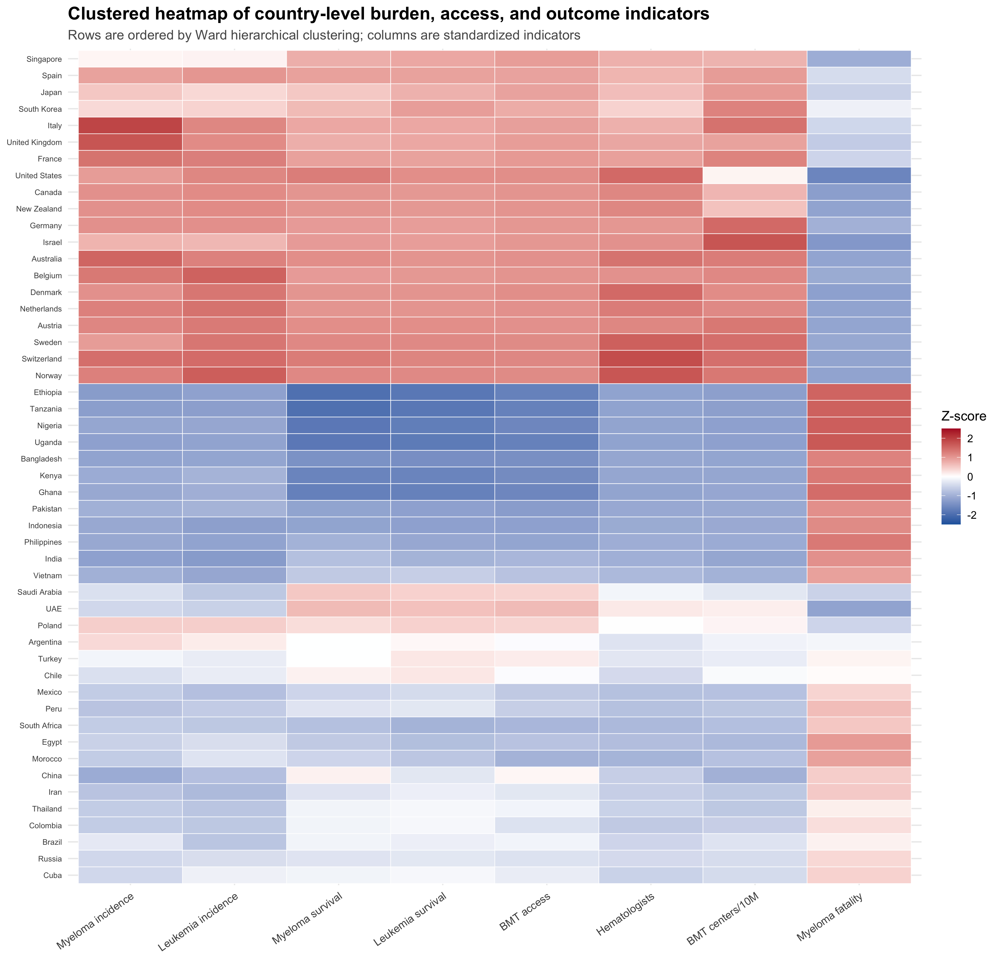
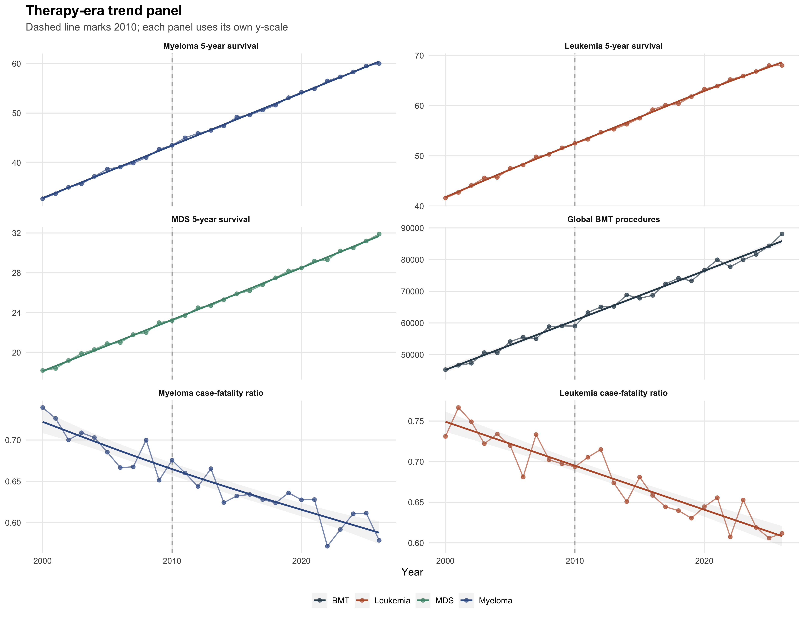
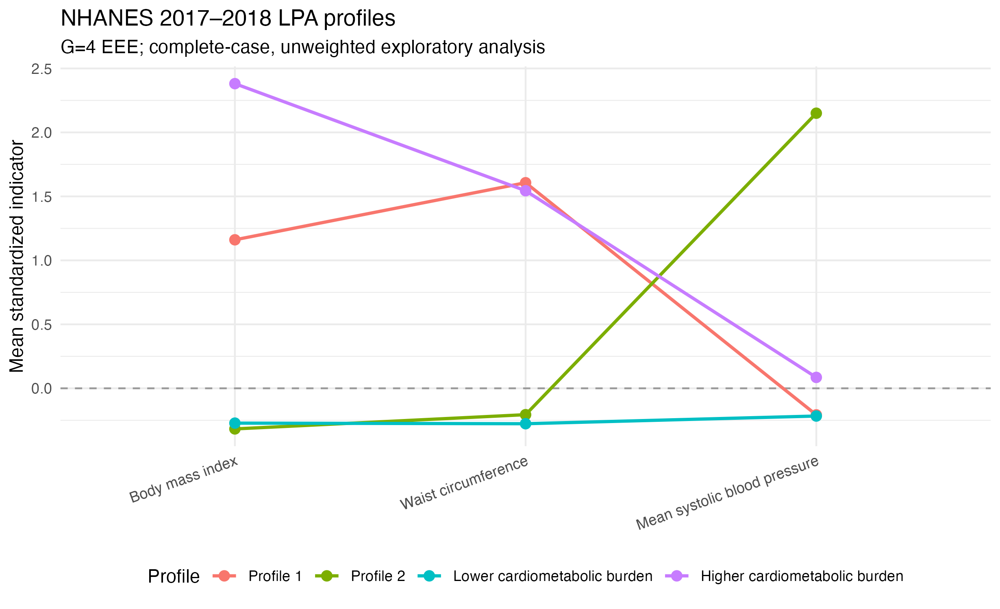

# R Medical Statistics Skills

<p align="center">
  
</p>

[English version](README.en.md)

一套面向医学统计和 R 语言分析场景的 AI coding agent skills。项目采用通用 `SKILL.md` 结构，可供 Codex 以及其他支持技能、规则或知识库目录的 coding agent 使用；也可以把相关目录直接发送给 agent，让其按自己的运行环境安装或读取。项目包含基础统计、高级统计、医学文献常用统计方法，以及用于生成普通 R 脚本、统计报告和维护 Jupyter Notebook 的辅助 skill。

## Contents

- `basic-stats/`: t 检验、方差分析、卡方检验、相关分析、ROC、样本量、统计绘图等基础医学统计 skill。
- `advanced-stats/`: 协方差分析、多元回归、Logistic 回归、生存分析、PCA、结构方程、多水平模型、潜在剖面分析等进阶统计 skill。
- `literature-stats/`: 倾向评分、Fine-Gray、限制性立方样条、亚组分析、趋势检验等医学文献常见方法 skill。
- `r-script/`: 原创 R 脚本 skill，用于为 RStudio、命令行 R 或非 notebook 用户生成可复现 `.R` 分析脚本。
- `quarto-report/`: 原创 Quarto/R Markdown 报告 skill，用于生成可导出 HTML、Word 或 PDF 的医学统计分析报告。
- `jupyter-notebook/`: 原创 Jupyter Notebook skill，用于创建、整理和验证可复现 notebook。
- `example/`: 基于公开数据集整理的可复现示例，包含演示数据、notebook、R 脚本、统计表和图形结果。

## Examples

`example/` 目录提供一个较完整、代表性更强的医学统计案例，用于展示本项目 skills 如何把公开数据整理成可复现的 R 分析流程。示例包含 `data/` 原始数据、`analysis/` 分析脚本与结果表，以及 `analysis/figures/` 中可直接用于报告的图表。

### Global Bone Marrow Cancer Dataset

- **数据来源**：[Global Bone Marrow Cancer Dataset](https://www.kaggle.com/datasets/zkskhurram/global-bone-marrow-cancer-dataset)
- **示例目录**：`example/global-bone-marrow-cancer-dataset/`
- **数据规模**：包含国家层面的骨髓瘤/白血病发病率、生存率、骨髓移植可及性、血液科医生数量、治疗方式和 2000-2026 年趋势数据。

这个示例用于展示更偏公共卫生和卫生服务研究的问题：不同地区的血液肿瘤负担、治疗资源可及性与生存结局之间是否存在系统差异。当前 README 以 `analysis/advanced_bone_marrow_analysis.ipynb` 作为主展示示例：notebook 使用 R kernel 编写，图表统一保存到 `analysis/advanced_figures/`，模型结果表保存到 `analysis/advanced_results/`。原有拆分 R 脚本仍保留在 `analysis/` 中，便于对照基础流程与进阶 notebook 流程。

主要分析结果保存在 `analysis/`：

- `table1_by_continent.csv`：按大陆汇总的描述性统计。欧洲和大洋洲的骨髓瘤 5 年生存率、BMT 可及性评分和每百万人血液科医生数量整体高于非洲等地区。
- `01_descriptive_stats_plots.R` 至 `06_trend_analysis.R`：按分析主题拆分的 R 脚本，覆盖描述性统计、相关检验、ANOVA/卡方检验、回归、PCA/聚类和趋势分析。
- `advanced_bone_marrow_analysis.ipynb`：R notebook 进阶分析流程，包含 Bootstrap 稳定性回归、GAM 非线性建模、PCA 国家表型、k-means 聚类、聚类热图、治疗时代趋势和收入地区生存轨迹。
- `advanced_results/`：保存进阶模型结果表，包括标准化 Bootstrap 回归系数、GAM 平滑项、PCA 国家表型、聚类画像和分段趋势模型。
- `advanced_figures/`：保存进阶图表 PNG，可直接放入 README、报告或演示文稿。

代表性进阶图表如下。

**Bootstrap 标准化回归系数稳定性森林图**



**GAM 非线性 BMT 可及性-生存率关系**



**PCA 国家表型与聚类解释图**



**国家层面负担、资源与结局指标聚类热图**



**治疗时代趋势面板**



示例图表代码片段：

```r
library(mgcv)
library(ggplot2)

gam_fit <- gam(
  Myeloma_5Y_Survival_Pct ~
    s(BMT_Access_Score, k = 5) +
    s(Hematologists_Per_Million, k = 5) +
    s(Myeloma_Incidence_Per_100K, k = 5),
  data = country,
  method = "REML"
)

gam_pred <- predict(gam_fit, newdata = gam_grid, se.fit = TRUE)
```

## 推荐使用方式

- **普通 R 脚本**：不使用 Jupyter 的用户优先使用 `r-script/`，输出 `analysis.R`，可在 RStudio 中 Source，或用 `Rscript analysis.R` 在命令行运行。
- **Jupyter Notebook**：适合交互式探索、教学演示、逐步解释和需要 `.ipynb` 交付的任务。
- **Quarto / R Markdown 报告**：使用 `quarto-report/`，适合正式报告、论文附录、课题汇报，以及可导出的 HTML、Word、PDF。

## 潜在剖面分析示例

`advanced-stats/latent-profile-analysis/` 提供医学 LPA 的完整工作流，覆盖连续指标选择、候选高斯混合模型、类别数选择、后验概率、分类不确定性、稳定性和外部变量推断边界。

### NHANES 心代谢指标剖面示例

在 [`example/nhanes-lpa/`](example/nhanes-lpa/) 中，独立子 agent 使用 NHANES 2017–2018 成人 BMI、腰围和平均收缩压识别经验性心代谢剖面。5,265 名 MEC 成人中有 4,754 名完整病例，候选模型最终选择 `G=4, EEE`；最小类别占 5.5%，平均最大后验概率为 0.856。该结果是未加权、样本内的探索性分析，不代表全国估计或临床亚型。完整过程见 [`nhanes_lpa_report.Rmd`](example/nhanes-lpa/analysis/nhanes_lpa_report.Rmd) 和 [`nhanes_lpa_report.html`](example/nhanes-lpa/results/nhanes_lpa_report.html)。





## Install

Codex 默认安装：

```bash
curl -fsSL https://raw.githubusercontent.com/LeiGao0203/R-Medical-Statistics-Skills/main/install.sh | bash
```

如果使用其他 coding agent，将安装目录改成该 agent 的 skills、rules 或知识库目录即可：

```bash
curl -fsSL https://raw.githubusercontent.com/LeiGao0203/R-Medical-Statistics-Skills/main/install.sh | AGENT_SKILLS_DIR=/path/to/agent/skills bash
```

也可以直接把本仓库地址或上述命令发送给 agent，让它根据自己的工具链完成安装。安装后重启或刷新对应 agent，相关 skill 会在医学统计、R 脚本、统计报告或 notebook 任务中触发。

## License

本项目采用混合许可证：

- `basic-stats/`、`advanced-stats/`、`literature-stats/` 中与《R语言实战医学统计》相关的内容，改编自阿越就是我的开源项目 [R_medical_stat](https://github.com/ayueme/R_medical_stat)，按 CC BY-SA 4.0 发布。
- `r-script/`、`quarto-report/` 和 `jupyter-notebook/` 为原创内容，按 Apache License 2.0 发布。
- `example/` 中的数据来自对应公开数据源；再次使用时请遵守原数据集页面及其授权条款。

详见 [LICENSE](LICENSE)。

## Attribution

统计类 skill 的部分内容基于《R语言实战医学统计》整理和改写。再次分发、修改或演绎相关内容时，请保留原作者署名和 CC BY-SA 4.0 授权信息。

## Contributing

欢迎补充新的统计方法、修正代码示例、改进方法选择逻辑或增加可复现实例。提交前请阅读 [CONTRIBUTING.md](CONTRIBUTING.md)。
